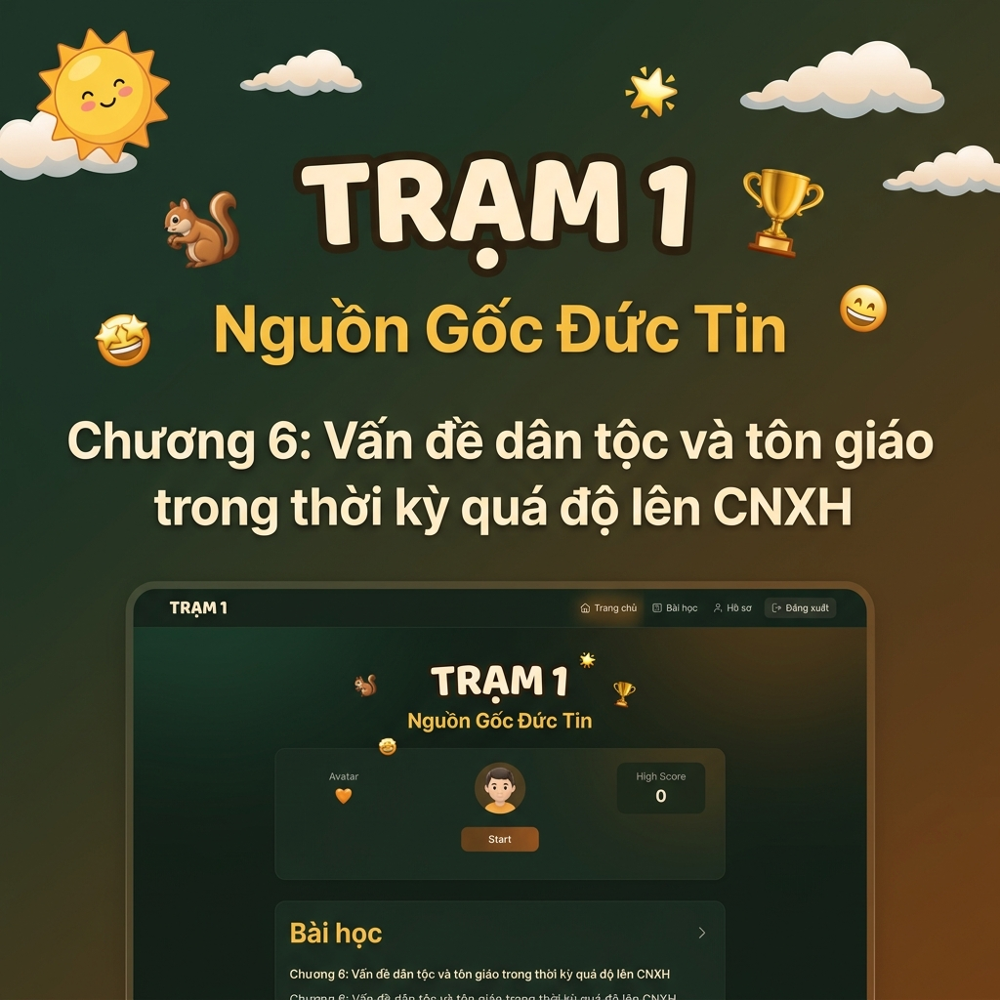
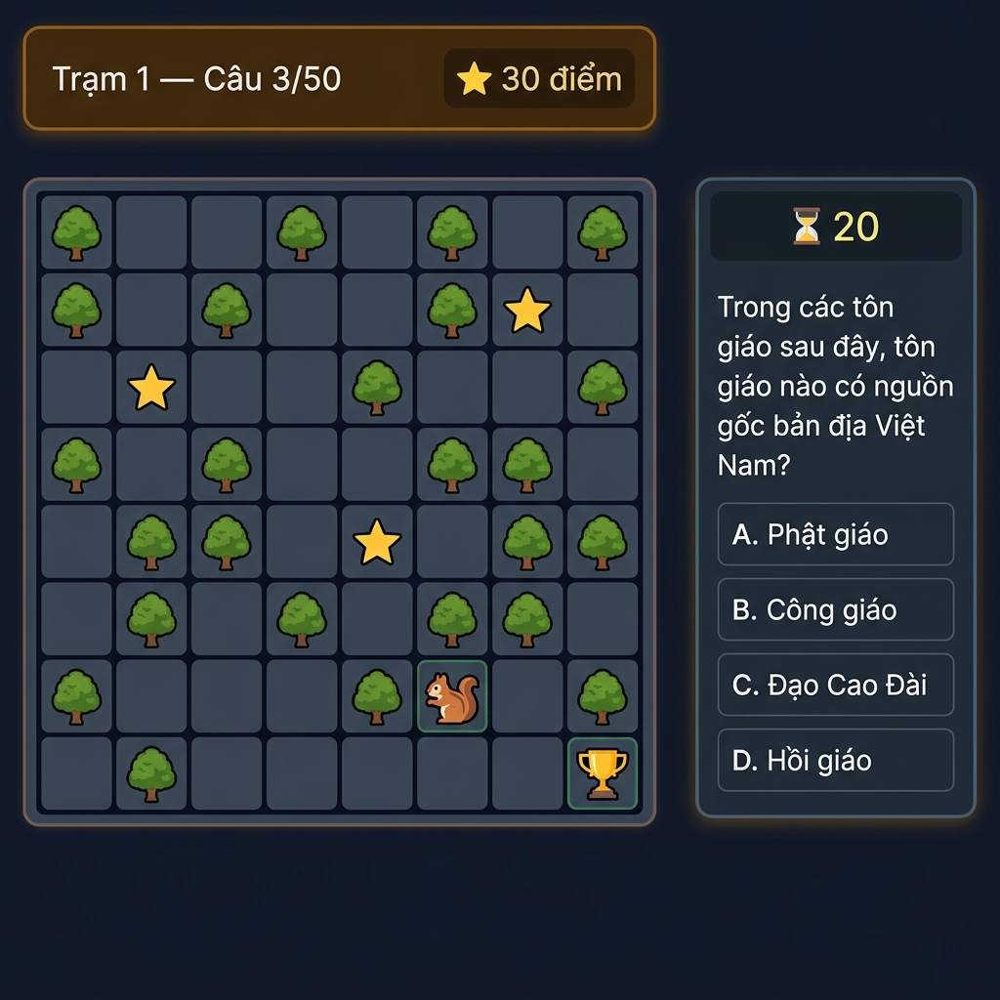

# 🏛️ Trạm 1 — Nguồn Gốc Đức Tin | MLN131

> Web game thử thách kiến thức **Chương 6: Vấn đề dân tộc và tôn giáo trong thời kỳ quá độ lên CNXH**

🔗 **Chơi ngay:** [game-mln131.vercel.app](https://game-mln131.vercel.app)

---

## 📸 Demo

### Trang chủ


### Gameplay — Mê cung & Câu hỏi


---

## 🎮 Cách chơi

1. Nhập **Họ tên, MSSV, Mã lớp** → Bắt đầu
2. Điều khiển 🐿️ bằng **phím mũi tên / WASD** hoặc **click chuột**
3. Bước vào ⭐ → Trả lời câu hỏi trắc nghiệm trong **20 giây**
4. ✅ Đúng → mở đường | ❌ Sai/Hết giờ → ô biến thành 🌳 chặn đường
5. Hết đường đi → **Thua** | Đến được 🏆 → **Thắng**
6. Xếp hạng theo **thời gian hoàn thành nhanh nhất**

---

## 🛠️ Công nghệ

| Công nghệ | Mục đích |
|---|---|
| Next.js 15 | Framework React SSR |
| TypeScript | Type-safe code |
| TailwindCSS | Styling |
| Firebase Firestore | Database & Leaderboard |
| Framer Motion | Animations |
| Vercel | Hosting |

---

## 🚀 Chạy local

```bash
npm install
npm run dev
```

Mở [http://localhost:3000](http://localhost:3000)

---

## 📝 Nội dung câu hỏi

- 50 câu hỏi trắc nghiệm về **Chương 6 — Chủ nghĩa xã hội khoa học**
  - Chủ nghĩa Mác - Lênin về tôn giáo
  - Tôn giáo ở Việt Nam và chính sách tôn giáo của Đảng, Nhà nước
  - Quan hệ dân tộc và tôn giáo ở Việt Nam

---

## 📄 License

MIT
